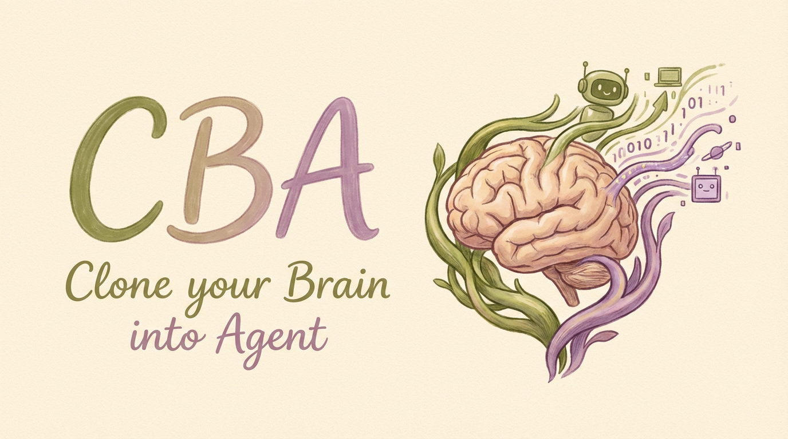
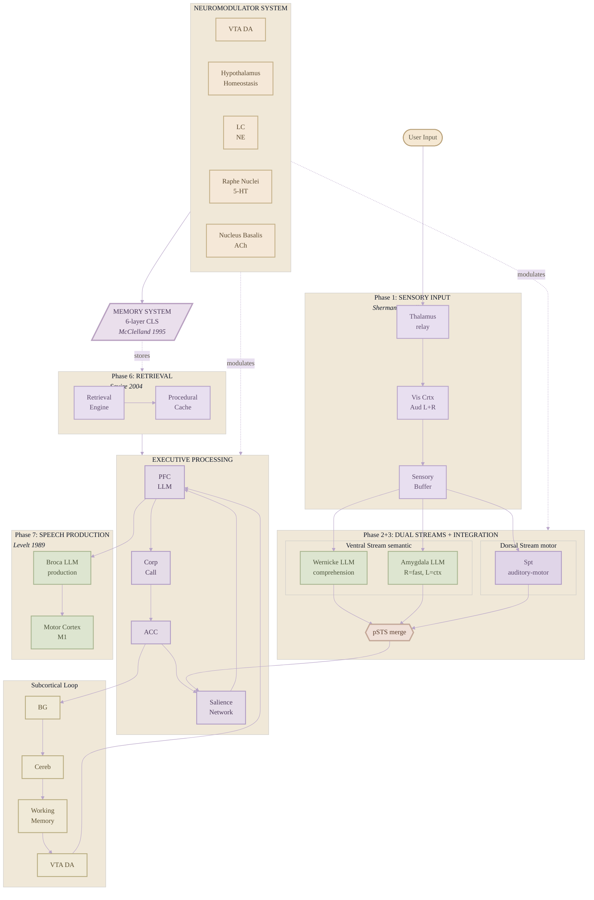

<p align="center">
  
</p>

<h1 align="center">CBA — Clone your Brain into Agent</h1>
<h2 align="center">Who will control Ralph?</h2>

<p align="center">
  
  
  
  
  
</p>

---

## About

CBA is an AI agent framework built on the foundations of over 50 neuroscience and cognitive science publications. Rather than treating the brain as a loose metaphor, every region, memory layer, and neuromodulator pathway in this system traces back to peer-reviewed research — from Baars' Global Workspace Theory to McClelland's Complementary Learning Systems, from LeDoux's amygdala fast-path to Hickok & Poeppel's dual-stream language model.

The architectural direction was initially inspired by [OpenClaw](https://github.com/OpenClaw). We studied its modular design philosophy and adapted it into a neuroscience-grounded cognitive pipeline, optimizing each component to mirror how the human brain actually processes information — from sensory gating through emotional appraisal to speech production.

This project is far from complete. There are rough edges, unexplored ideas, and plenty of room for improvement. We are releasing CBA as open source with the hope that it can grow through community collaboration — researchers, engineers, and curious minds contributing perspectives we haven't considered, catching mistakes we've overlooked, and pushing the framework in directions we haven't imagined. If even a small part of this work sparks a useful conversation or inspires a new approach, it will have been worthwhile.

Contributions, feedback, and discussion are always welcome.

---

## Quick Start

### Requirements

- Python >= 3.11
- Node.js >= 18 (for dashboard)
- API key from **any** supported provider

### Install

```bash
git clone https://github.com/hyungwoo822/CBA.git
cd CBA

python -m venv .venv
source .venv/bin/activate   # Windows: .venv\Scripts\activate
pip install -e ".[dev]"

# Dashboard
cd dashboard && npm install && cd ..
```

### Configure

```bash
cp .env.example .env
```

Set **at least one** API key in `.env`:

| Provider | Env Variable | Model Example |
|----------|-------------|---------------|
| **OpenAI** | `OPENAI_API_KEY` | `openai/gpt-4o-mini` (default) |
| **Anthropic Claude** | `ANTHROPIC_API_KEY` | `anthropic/claude-sonnet-4-20250514` |
| **Google Gemini** | `GEMINI_API_KEY` | `gemini/gemini-2.0-flash` |
| **xAI Grok** | `XAI_API_KEY` | `xai/grok-2` |

Override the default model:
```bash
BRAIN_AGENT_MODEL="anthropic/claude-sonnet-4-20250514"
```

### Usage

```python
from brain_agent import BrainAgent

async with BrainAgent() as agent:
    result = await agent.process("Explain how memory consolidation works")
    print(result.response)
```

### CLI

```bash
brain-agent run            # Interactive agent
brain-agent dashboard      # Start dashboard (port 3000)
brain-agent memory stats   # Memory statistics
```

---

## Architecture



---

## Brain Regions

23 regions across 10 lobes with anatomically correct hemisphere assignments. Six regions use LLM calls (Wernicke, Amygdala R+L, PFC, Broca, Visual Cortex); all others are algorithmic.

| Region | Hemisphere | Function |
|--------|-----------|----------|
| **Prefrontal Cortex (PFC)** | Bilateral | LLM reasoning, goal tree, entity extraction |
| **ACC** | Bilateral | Conflict monitoring, error accumulation |
| **Broca's Area** | Left | LLM language production |
| **Thalamus** | Bilateral | Sensory relay and gating |
| **Hypothalamus** | Bilateral | Homeostatic regulation |
| **Amygdala** | R/L split | R=fast appraisal, L=contextual evaluation |
| **Wernicke's Area** | Left | LLM semantic analysis |
| **Auditory Cortex** | L + R | Speech (L) + prosody (R) |
| **Visual Cortex** | Bilateral | Image processing |
| **Angular Gyrus** | Left | Cross-modal semantic binding |
| **pSTS** | Left | Multisensory stream merging |
| **Spt** | Left | Auditory-motor interface |
| **Motor Cortex** | Left | Final output execution |
| **Salience Network** | Bilateral | DMN/ECN/Creative mode switching |
| **Basal Ganglia** | Bilateral | Go/NoGo action selection |
| **Corpus Callosum** | Bilateral | Inter-hemisphere integration |
| **Cerebellum** | Bilateral | Forward model prediction |
| **VTA** | Bilateral | Dopamine, reward prediction error |
| **Brainstem** | Bilateral | Arousal regulation |
| **mPFC** | Bilateral | Self-referential processing |
| **TPJ** | Right | Theory of Mind |
| **Insula** | Bilateral | Interoceptive awareness |
| **Hippocampus** | Bilateral | Fast encoding, modality tagging |

---

## Memory System

Six-layer pipeline: Atkinson-Shiffrin + CLS (McClelland 1995) + Baddeley working memory.

```
Sensory Buffer --> Working Memory --> Hippocampal Staging --> Episodic Store
                                              |                     |
                                              |              Consolidation
                                              |                     |
                                              +----------> Semantic Store
                                                           Procedural Store
```

| Layer | Key Mechanism |
|-------|---------------|
| **Sensory Buffer** | Per-cycle flush (Sperling 1960) |
| **Working Memory** | Baddeley model: phonological + visuospatial + episodic buffer |
| **Hippocampal Staging** | ACh-modulated fast encoding |
| **Episodic Store** | Ebbinghaus forgetting, reconsolidation |
| **Semantic Store** | Knowledge graph with confidence tagging, Leiden community detection, spreading activation |
| **Procedural Store** | DA-gated learning, 3-stage skill acquisition (Fitts 1967) |

### Knowledge Graph Analysis

The semantic store includes a graph analysis layer inspired by connectomics research. The knowledge graph is not a flat triple store — it has structure.

| Feature | Mechanism | Neuroscience |
|---------|-----------|-------------|
| **Community Detection** | Leiden algorithm on concept graph | Cortical columns (Mountcastle 1997) |
| **Hub Concepts** | Degree-ranked central nodes | Rich-club organization (van den Heuvel & Sporns 2011) |
| **Surprising Connections** | Cross-community bridge scoring | Long-range cortical projections |
| **Confidence Tagging** | EXTRACTED / INFERRED / AMBIGUOUS per edge | Signal Detection Theory (Green & Swets 1966) |
| **Graph Diff** | LTP (new) / LTD (lost) / pruning classification | Synaptic plasticity (Bliss & Lomo 1973) |
| **Compressed Context** | Graph summary instead of raw memory dump | Chunking (Miller 1956) |
| **Embedding Cache** | SHA256 content-addressable LRU | Long-term potentiation (faster reactivation) |
| **Cell Assemblies** | Hyperedge groups (3+ concepts) with co-activation | Hebb's Cell Assembly (1949) |
| **Assembly Co-activation** | Active member triggers ensemble spread | Neural ensemble synchronization |
| **Graph Pruning** | Weight decay + threshold pruning during consolidation | Synaptic pruning (Huttenlocher 1979) |
| **Metacognitive Query** | MCP tools for self-inspecting knowledge | Metacognition (Flavell 1979) |
| **Community-Aware Activation** | Intra-community spread bonus in retrieval | Cortical column facilitation |

Confidence flows into the neuromodulator system: AMBIGUOUS edges raise NE (alertness) and ACh (learning), triggering ACC conflict monitoring. EXTRACTED edges pass through without friction. This mirrors how the brain allocates more attention to uncertain information.

Cell assemblies (hyperedges) enable group-level memory: when one member of an assembly activates during retrieval, all members receive co-activation spread — just as Hebbian ensembles fire as coordinated units. The MCP knowledge server exposes `query_graph`, `get_neighbors`, `list_communities`, `find_hubs`, `find_bridges`, and `get_assemblies` as agent-callable tools, enabling metacognitive self-inspection.

---

## Neuromodulator System

Six neurochemical systems with different decay rates and anatomically correct source nuclei.

| NT | Source | Effect | Decay |
|----|--------|--------|-------|
| **DA** | VTA/SNc | Reward prediction error | 0.85 |
| **NE** | Locus Coeruleus | Urgency, alertness | 0.85 |
| **5-HT** | Dorsal Raphe | Patience, inhibition | 0.90 |
| **ACh** | Nucleus Basalis | Learning strength | 0.85 |
| **CORT** | HPA Axis | Stress response | 0.93 |
| **EPI** | Adrenal Medulla | Fight-or-flight | 0.75 |

---

## Dashboard

Real-time 3D brain visualization: React 19 + Three.js + WebSocket.

```bash
brain-agent dashboard --port 3000
```

- 21 brain regions with activation glow and sequential cascade
- Signal particles flowing between regions
- 25+ anatomical neural connections
- HUD with network mode and 6 neurotransmitter bars
- Memory flow pipeline with live counts
- Knowledge graph visualization with community coloring, hub highlighting, and confidence-based edges
- Audio input with voice mode
- Multimodal input (image, audio, text)

---

## Project Structure

```
CBA/
├── brain_agent/
│   ├── agent.py              # Main entry point
│   ├── pipeline.py           # 7-phase neural pipeline
│   ├── config/               # Pydantic configuration
│   ├── core/                 # Signals, neuromodulators, router
│   ├── regions/              # 23 brain regions
│   ├── memory/               # 6-layer memory system + graph analysis
│   ├── providers/            # LLM provider (LiteLLM)
│   ├── dashboard/            # FastAPI WebSocket server
│   ├── tools/                # Tool registry
│   ├── mcp/                  # MCP integration
│   └── middleware/            # Middleware chains
├── dashboard/                # React + Three.js frontend
├── tests/                    # 621+ tests
├── .env.example              # Environment template
└── LICENSE                   # MIT
```

---

## Tests

```bash
pytest                  # 621+ tests
pytest --cov            # With coverage
```

---

## Branches

| Branch | Description |
|--------|-------------|
| `main` | Stable release |
| `graphify` | Knowledge graph analysis: Leiden clustering, cell assemblies, MCP metacognition, dashboard viz |
| `openclaw` | Extended features: MCP, tool system, middleware |

---

## References

This framework is grounded in **50+ published neuroscience papers** spanning 1929–2023.

### Brain Regions & Circuits

| Citation | Topic | Region |
|----------|-------|--------|
| Hubel & Wiesel (1959) | Receptive fields in visual cortex | Visual Cortex (V1) |
| Milner (1971) | Hippocampal hemisphere specialization | Hippocampus |
| Ungerleider & Mishkin (1982) | Two cortical visual systems (ventral/dorsal) | Visual Cortex |
| Baars (1988) | Global Workspace Theory — broadcast mechanism | Pipeline |
| Levelt (1989) | Speaking: From Intention to Articulation | Motor Cortex, Broca |
| Mink (1996) | Basal ganglia Go/NoGo gating | Basal Ganglia |
| LeDoux (1996) | The Emotional Brain | Amygdala |
| Morris et al. (1998) | Right hemisphere automatic emotional processing | Amygdala R |
| Baddeley (2000) | Working memory: episodic buffer and capacity limits | Working Memory |
| Calvert et al. (2000) | pSTS superadditivity for congruent stimuli | pSTS |
| Wheeler et al. (2000) | Multisensory memory retrieval reactivation | pSTS |
| Eichenbaum (2000) | Hippocampus and entity extraction | PFC |
| Goldberg (2001) | PFC lateralization: left=routine, right=novel | PFC |
| Botvinick et al. (2001) | Conflict monitoring and cognitive control | ACC |
| Holroyd & Coles (2002) | Error-related negativity | ACC |
| Corbetta & Shulman (2002) | Dorsal/ventral attention streams | Attention |
| Saxe & Kanwisher (2003) | People thinking about thinking people | TPJ |
| Glascher & Adolphs (2003) | Amygdala response processing | Amygdala |
| Hickok et al. (2003) | Speech production planning | Spt |
| Beauchamp et al. (2004) | Audiovisual integration in pSTS | pSTS |
| Critchley et al. (2004) | Interoceptive awareness | Insula |
| Squire (2004) | Hippocampal memory binding | Hippocampus |
| Beeman (2005) | Right hemisphere creative insight | PFC |
| D'Argembeau et al. (2005) | Self-referential processing in mPFC | mPFC |
| Frank (2005) | Direct/indirect pathway balance | Basal Ganglia |
| Frith & Frith (2006) | Neural basis of mentalizing | TPJ |
| Northoff et al. (2006) | Self-referential processing in mPFC | mPFC |
| Guenther (2006) | DIVA model of speech production | Motor Cortex |
| Sherman & Guillery (2006) | Exploring the Thalamus | Thalamus |
| Paulus & Stein (2006) | Interoception and risk processing | Insula |
| Barrett (2006) | Constructionist emotion theory | Amygdala |
| Hickok & Poeppel (2007) | Dual-stream model of speech processing | Wernicke, Broca, Spt, A1 |
| Sherman (2007) | Thalamus is more than just a relay | Thalamus |
| Aron (2007) | Conflict-induced braking (GABA) | PFC |
| McAlonan et al. (2008) | Thalamic reticular nucleus attention gating | Thalamus |
| Ito (2008) | Cerebellar forward models and motor learning | Cerebellum |
| Graybiel (2008) | Procedural memory pattern caching | Procedural Store |
| Pessoa (2008) | Content-driven dynamic activation | Pipeline |
| Van Overwalle (2009) | Social cognition and TPJ meta-analysis | TPJ |
| Craig (2009) | How Do You Feel — Now? Interoception | Insula |
| Singer et al. (2009) | Emotion-interoception integration | Insula |
| Dehaene (2009) | Orthographic visual processing (LGN) | Thalamus |
| Price (2010) | Reading and the angular gyrus | Angular Gyrus |
| Buchsbaum et al. (2011) | Verbal working memory | Spt |
| Menon (2011) | Network mode detection and switching | Salience Network |
| Ramachandran (2011) | Cross-modal abstraction | Angular Gyrus |
| Isaacson & Scanziani (2011) | E/I balance compensation (GABA) | Pipeline |
| Fleming & Dolan (2012) | Neural basis of metacognitive ability | PFC |
| Yeung & Summerfield (2012) | Metacognition in decision-making | PFC |
| Ghosh & Gilboa (2014) | Schemas always active in mPFC | mPFC |
| Buzsáki (2015) | Hippocampal sharp-wave ripples | Consolidation |
| Beaty et al. (2018) | Creative cognition and the default mode network | Salience Network |

### Memory & Learning

| Citation | Topic | System |
|----------|-------|--------|
| Sperling (1960) | Sensory buffer iconic memory | Sensory Buffer |
| Fitts (1967) | Three-stage skill acquisition | Procedural Store |
| Anderson (1994) | Retrieval-induced forgetting | Retrieval Engine |
| McClelland et al. (1995) | Complementary Learning Systems | Consolidation |
| Wozniak (1990) | SM-2 spaced repetition algorithm | Episodic Store |
| Nader (2000) | Memory reconsolidation | Episodic Store |
| Yassa & Stark (2011) | Pattern separation in dentate gyrus | Hippocampal Staging |
| Winocur & Moscovitch (2011) | Episodic → semantic transformation | Consolidation |
| Tononi & Cirelli (2006) | Synaptic homeostasis hypothesis | Homeostatic Scaling |
| Zielinski et al. (2018) | Slow-wave sleep consolidation | Consolidation |
| Park et al. (2023) | Generative Agents: reflection mechanism | Reflection |
| Diekelmann & Born (2010) | Memory consolidation during sleep | Dreaming Engine |
| Rasch & Born (2013) | About sleep's role in memory | Dreaming Engine |

### Neuromodulator Systems

| Citation | Topic | System |
|----------|-------|--------|
| Cannon (1929) | Fight-or-flight response | Epinephrine |
| Gold & Van Buskirk (1975) | Epinephrine enhances memory | Epinephrine |
| Schultz (1997) | Dopamine reward prediction error | Dopamine / VTA |
| Cahill & McGaugh (1998) | Emotion and memory consolidation | Epinephrine |
| Grace (2000) | Tonic vs phasic dopamine firing | Dopamine / VTA |
| de Quervain et al. (2000) | Cortisol impairs memory retrieval | Cortisol |
| Doya (2002) | Serotonin and temporal discounting | Serotonin |
| Sapolsky (2004) | Stress and cortisol effects on cognition | Cortisol |
| Dickerson & Kemeny (2004) | Social-evaluative threat and cortisol | Cortisol |
| Aston-Jones & Cohen (2005) | Adaptive gain theory (norepinephrine) | Norepinephrine |
| Phelps & LeDoux (2005) | Amygdala-cortisol interaction | Amygdala |
| Friston (2005) | Predictive coding framework | Pipeline |
| Hasselmo (2006) | ACh gating: novelty, learning, plasticity | Acetylcholine |
| Buzsáki (2006) | Cortical oscillations and GABA | GABA |
| McEwen (2007) | Allostatic load and stress persistence | Cortisol |
| Kirschbaum et al. (1995) | Cortisol and stress recovery | Cortisol |
| Schneider & Shiffrin (1977) | Automatic vs controlled processing | Pipeline |
| Lamme (2006) | Recurrent processing and consciousness | Pipeline |
| Rolls (2013) | Pattern completion in CA3 | Retrieval Engine |

### Graph Analysis & Connectomics

| Citation | Topic | System |
|----------|-------|--------|
| Green & Swets (1966) | Signal Detection Theory | Confidence Scoring |
| Miller (1956) | Chunking and working memory capacity | Compressed Context |
| Bliss & Lomo (1973) | Long-term potentiation | Graph Diff (LTP) |
| Huttenlocher (1979) | Synaptic pruning during development | Graph Diff (pruning) |
| Mountcastle (1997) | Cortical column modularity | Leiden Community Detection |
| Watts & Strogatz (1998) | Small-world network topology | Knowledge Graph |
| van den Heuvel & Sporns (2011) | Rich-club organization in brain networks | Hub Concept Detection |
| Frankland & Bontempi (2005) | Systems consolidation | Leiden-based Consolidation |
| Reyna & Brainerd (1995) | Fuzzy-trace theory (gist extraction) | Compressed Context |
| Hebb (1949) | Cell Assembly theory | Hyperedges / Co-activation |
| Flavell (1979) | Metacognition | MCP Knowledge Server |
| Collins & Loftus (1975) | Spreading activation | Community-aware retrieval |

---

## Star History

<a href="https://star-history.com/#hyungwoo822/CBA&Date">
 <picture>
   <source media="(prefers-color-scheme: dark)" srcset="https://api.star-history.com/svg?repos=hyungwoo822/CBA&type=Date&theme=dark" />
   <source media="(prefers-color-scheme: light)" srcset="https://api.star-history.com/svg?repos=hyungwoo822/CBA&type=Date" />
   
 </picture>
</a>

---

## License

[MIT](LICENSE)
